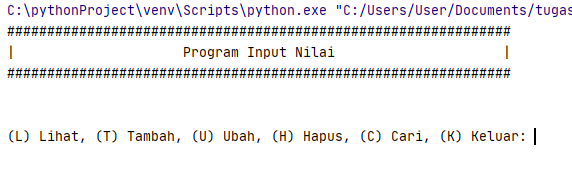
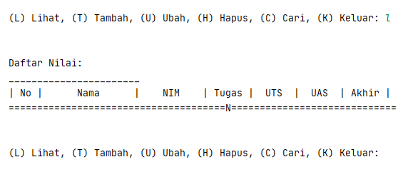
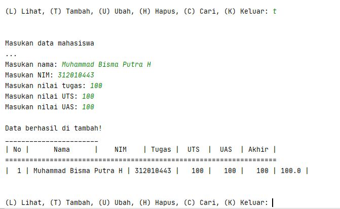

# Pertemuan9

### NAMA  : MUHAMMAD BISMA PUTRA H
### NIM   : 312010443   
### KELAS : TI.20.A.1

________________________________________________________________________________________________________________
## Program Data Mahasiswa
pada praktikum 5 ini, saya akan membuat program sederhana untuk menginput data kedalam list.


### Membuat Pintasan "Keluar"
Kali ini kita akan membuat pintasan "keluar" dengan baris perintah sebagai berikut

```python
    if menu.lower() == 'k':
        break
```
 <br>

### Membuat Pintasan "lihat"
dan ini adalah baris perintah untuk membuat perintah "lihat"

```python
    elif menu.lower() == 'l':
        print("Daftar Nilai:")
        print("_______________________")
        print("| No |      Nama      |    NIM    | Tugas |  UTS  |  UAS  | Akhir |")
        print("===================================================================")
        no = 1
        for tabel in data.values():
            print("| {0:2} | {1:14} | {2:9} | {3:5} | {4:5} | {5:5} | {6:5} |".format
                  (no, tabel[0],
                   tabel[1], tabel[2],
                   tabel[3], tabel[4], tabel[5]))
            no += 1
```
 <br>

### Membuat Pintasan "Tambah"
kali ini kita akan membuat baris perintah "tambah" untuk menambahkan data baru kedalam syntax database tersebut, berikut adalah baris perintahnya:

```python
    elif menu.lower() == 't':
        print("Masukan data mahasiswa")
        print("...")
        nama = input("Masukan nama: ")
        nim = input("Masukan NIM: ")
        nilai_tugas = int(input("Masukan nilai tugas: "))
        nilai_uts = int(input("Masukan nilai UTS: "))
        nilai_uas = int(input("Masukan nilai UAS: "))
        nilai_akhir = (nilai_tugas)*30/100 + (nilai_uts)*35/100 + (nilai_uas)*35/100 
        data[nama] = [nama, nim, nilai_tugas, nilai_uts, nilai_uas, nilai_akhir]
        print('\nData berhasil di tambah!')
        print("_______________________")
        print("| No |      Nama      |    NIM    | Tugas |  UTS  |  UAS  | Akhir |")
        print("===================================================================")
        no = 1
        for tabel in data.values():
            print("| {0:2} | {1:14} | {2:9} | {3:5} | {4:5} | {5:5} | {6:5} |".format
                  (no, tabel[0],
                   tabel[1], tabel[2],
                   tabel[3], tabel[4], tabel[5]))
            no += 1
```


Berikut adalah tampilan outputnya;
 <br>
