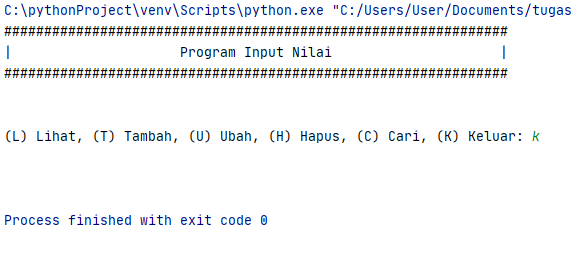

# Pertemuan9

### NAMA  : MUHAMMAD BISMA PUTRA H
### NIM   : 312010443   
### KELAS : TI.20.A.1

________________________________________________________________________________________________________________
## Program Data Mahasiswa
pada praktikum 5 ini, saya akan membuat program sederhana untuk menginput data kedalam list.


### Membuat Pintasan "Keluar"
Kali ini kita akan membuat pintasan "keluar" dengan baris perintah sebagai berikut

```python
    if menu.lower() == 'k':
        break
```
 <br>
